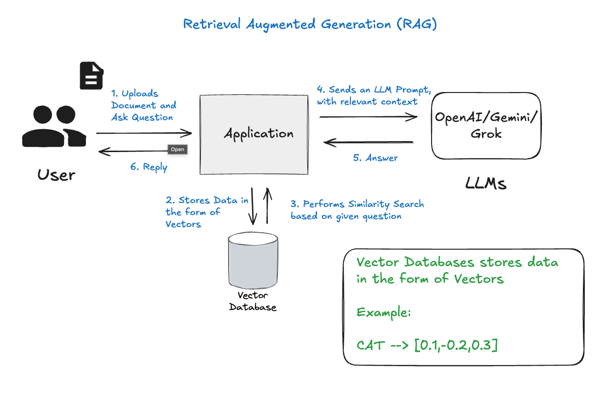
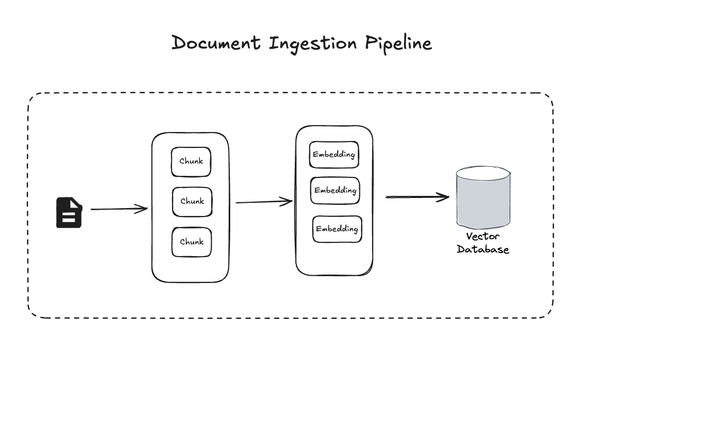

# 🧠 Spring AI RAG Assistant with Ollama & PGVector

This repository showcases a practical example of building a **Retrieval-Augmented Generation (RAG)** system using **Spring AI**, **Ollama** for local LLM integration, and **PGVector** for embedding storage. The assistant is trained to answer questions related to **Spring Boot**, powered by its official reference documentation in PDF format.

---

## 🚀 Key Highlights

* ✨ **Spring AI** enables easy RAG implementation in Java
* 🧠 **Ollama** serves as a local LLM provider
* 📆 **PGVector** stores and retrieves document embeddings
* 📄 Auto-ingestion and chunking of Spring Boot PDF docs
* 🔌 RESTful API to query the assistant

---

## 🏧 System Overview

### 🔁 RAG Workflow Diagram



### 📅 Document Ingestion Flow



---

## 🛠️ Requirements

Before getting started, ensure you have the following installed:

* ✅ Java 21
* ✅ Docker + Docker Compose
* ✅ [Ollama](https://ollama.ai) (local install)
* ✅ Maven (or use the included Maven wrapper)

---

## ⚙️ Setup Guide

### 1. 🧠 Install Ollama

Download and install Ollama from their [official site](https://ollama.ai), and make sure it is running on `http://localhost:11434`.

### 2. 📆 Load a Lightweight Model

> If `mistral` requires too much RAM (5.5 GiB), you can use `gemma:2b` instead.

```bash
ollama pull gemma:2b
ollama run gemma:2b
```

### 3. 🐐 Launch PGVector via Docker

```bash
docker-compose up -d
```

This will start a PostgreSQL container with the PGVector extension enabled on port `5432`.

### 4. 🔨 Build the Application

```bash
./mvnw clean install
```

---

## ▶️ Run the Application

```bash
./mvnw spring-boot:run
```

On startup, the application will:

* Initialize PGVector schema
* Parse and embed Spring Boot documentation
* Populate the vector database
* Start the REST API server

---

## 📡 How to Use

Send a question to the assistant with this example:

```bash
curl -X POST http://localhost:8080/api/chat \
     -H "Content-Type: text/plain" \
     -d "What is dependency injection in Spring?"
```

---

## 🧬 Core Configuration

* **Vector Store**: PostgreSQL + PGVector

    * DB: `vectordb`
    * User: `testuser`
    * Password: `testpwd`
    * Port: `5432`

* **LLM Setup**:

    * Model: `mistral` or `gemma:2b`
    * Base URL: `http://localhost:11434`
    * Auto-pull on first use

* **Document Processing**:

    * Uses Apache Tika to parse PDF
    * Splits text into optimal chunks
    * Automatically runs at startup

---

## 📁 Project Overview

| Component                       | Description                            |
| ------------------------------- | -------------------------------------- |
| `ChatController.java`           | Exposes REST API for chat queries      |
| `DocumentIngestionService.java` | Extracts and embeds documentation      |
| `application.properties`        | Configuration for LLM and database     |
| `compose.yml`                   | Docker setup for PostgreSQL + PGVector |

---

## 🧩 Troubleshooting

| Issue                 | Solution                                 |
| --------------------- | ---------------------------------------- |
| Ollama not responding | Ensure it's running at `localhost:11434` |
| Database not found    | Check Docker with `docker ps`            |
| No answers returned   | Make sure model is pulled and started    |
| Build errors          | Run `./mvnw clean install` again         |

---

## 📚 Tech Stack

* Spring Boot 3.4.3
* Spring AI 1.0.0-M6
* PGVector + PostgreSQL
* Apache Tika
* Ollama (LLM runtime)
* Docker Compose

---

Feel free to contribute, suggest improvements, or report any issues. Happy coding! 💡
